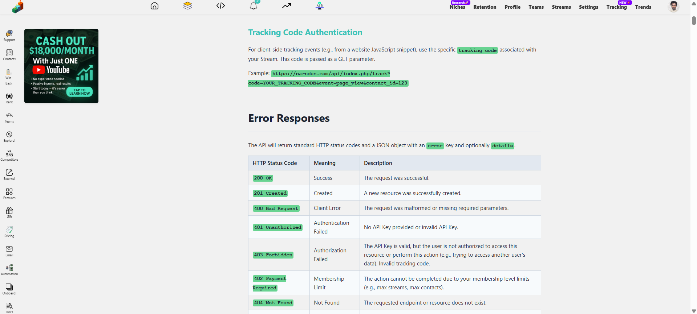

# -Churn-Analytics- 
SaaS software built with pure PHP, Javascript and SQL to launch an AI powered churn analysis, retention and win-back SaaS platform. Churn Analytics is a multi-million dollar worth of research and coding.

 ## (This software is not ready for production, please contact me on livejossymall@gmail.com or +79644165577 on whatsapp for clarifications, installation and custom development)

# 🚀 Churn Analytics Pro: Comprehensive Project Documentation
✨ Abstract: Revolutionizing Customer Retention in the Digital Age
In today's fiercely competitive digital landscape, customer acquisition costs are soaring, making customer retention the bedrock of sustainable business growth. Churn, the rate at which customers discontinue their service or subscription, is a silent killer of revenue and profitability for countless businesses. Yet, many companies struggle to accurately predict, understand, and effectively combat it.

Churn Analytics Pro isn't just another SaaS; it's an AI-powered intelligence platform designed to transform how businesses approach customer retention. By leveraging advanced analytics, predictive AI, and automated engagement tools, it empowers SaaS companies, high-ticket coaches, and premium membership providers to proactively identify at-risk customers, understand their underlying churn drivers, and execute targeted win-back strategies.

This project has the potential to be a million-dollar idea because it solves a universal, high-value problem with an innovative, data-driven solution. Imagine a SaaS company losing 5% of its customers monthly; that's 60% annually! A platform that can reduce this churn by even a few percentage points directly translates into millions of dollars saved and generated. For high-ticket coaches and premium memberships, where each client represents significant recurring revenue, preventing even one churn can mean thousands saved per month.

# 💡 Real-world examples of who desperately needs this:
A fast-growing online course platform: They acquire thousands of students but struggle with course completion and subscription renewals after the initial few months. Churn Analytics Pro can pinpoint students disengaging, identify underutilized course features, and trigger personalized nudges or offers to re-engage them, turning potential dropouts into lifelong learners.

A B2B SaaS tool for marketing agencies: Their monthly recurring revenue (MRR) is fantastic, but agencies often churn if they don't see immediate ROI. This platform can flag agency clients showing low feature adoption, slow login frequency, or increased support tickets, allowing the SaaS provider to intervene with proactive support or specialized training before cancellation.

A high-ticket executive coaching program: Each client pays tens of thousands of dollars. Losing even one is devastating. Churn Analytics Pro can track engagement with coaching materials, attendance in group sessions, or responsiveness to assigned tasks. If a client's engagement drops, the coach gets an alert, enabling a timely, personalized intervention that saves a high-value relationship.

A premium subscription box service: They need to keep members excited. By tracking product interaction, survey responses, and feedback, the platform can predict who might cancel next month and automate a targeted discount or a personalized gift to win them back.

In essence, Churn Analytics Pro acts as a predictive early warning system and an automated retention assistant, moving businesses from reactive damage control to proactive, intelligent customer success. This direct impact on the bottom line makes it not just relevant, but indispensable for modern digital businesses.

# 🏗️ Chapter 1: Core System Architecture and User Management
The foundation of Churn Analytics Pro is built on a robust LAMP stack (Linux, Apache, MySQL, PHP), designed for scalability and maintainability. All database interactions are centralized and secured, ensuring reliable user management and data handling.

# 1.1 User Authentication and Authorization
Our system provides secure user authentication, allowing users to register, log in, and manage their profiles. Administrators have elevated privileges to manage all user accounts.

Centralized Database Connection (db.php):

How it works: This file, located at the project root, is the single point for all database connections using PDO (PHP Data Objects). It ensures secure and efficient interaction with the MySQL database.

Relevance: All other PHP files requiring database access include this file. It also configures and stores BASE_URL in a database config table, providing a dynamic and easily manageable base for all links.

User Registration (auth/register.php):

How it works: New users sign up with a unique username, email, and password. A unique activation link is sent to their email; account activation occurs only upon clicking this link.

Relevance: Ensures data integrity with unique identifiers and verifies user emails, crucial for subsequent communication and security.

User Login (auth/login.php):

How it works: Users can log in using either their username or email combined with their password. Once logged in, sessions are configured to remain indefinite until explicit logout.

Relevance: Provides flexible access options and a seamless, uninterrupted user experience.

User Profile (profile.php):

How it works: Users manage personal and company details, including uploading a profile picture (stored in auth/uploads), inputting company name, selecting industry (from a predefined list via niches table and related admin panel), company size, company info, and their full name. They can set notification preferences for Email (default on) and SMS (default off), providing a phone number with country code. Crucially, they link their churn alert channels (Microsoft Teams, Slack, Discord) by providing webhook URLs. Integrations keys for Stripe, Chargebee, Segment.com, and others are also configured here for data import capabilities.

Relevance: Customizes the user experience, enables targeted communication, and establishes vital data import pipelines for their existing customer data.

User Logout (auth/logout.php):

How it works: Handles secure session termination when a user decides to log out.

Relevance: Ensures account security and allows users to manage their active login sessions.

Admin User Management (Admin Pages - admin/users.php, admin/email_settings.php):

How it works: Only users with is_admin = 1 can access these pages. admin/users.php displays all users in a paginated table (20 records/page), allowing for editing, deletion, and creation of new user accounts (including setting is_admin status). admin/email_settings.php allows configuration of email templates (with placeholders like {activation_link}) and selection of global email sending methods (PHP Mail or SMTP, with SMTP details stored in config table).

Relevance: Provides full administrative control over user base and ensures flexible, centralized communication management for the entire platform.

# ⚙️ Chapter 2: Account Settings and Integrations
Beyond core profile management, users can fine-tune their API access, tracking preferences, and payment methods.

# 2.1 User Settings Page (settings.php)
API Key Management:

How it works: Users can generate a unique, long alphanumeric API key for programmatic access. They can delete existing keys and generate new ones, with a limit of one active key at a time. This key allows their external systems to push data to Churn Analytics Pro.

Relevance: Empowers technical users to automate data synchronization from their own platforms into Churn Analytics Pro, reducing manual effort and ensuring real-time data flow for accurate analytics.

Tracking Method Selection:

How it works: Users select a global preference for tracking their third-party contacts:

GDPR/CCPA Tracking: Requires explicit cookie consent from their end-users.

Non-GDPR/CCPA Tracking: No mandatory cookie consent.

Hybrid Non-GDPR/CCPA Fallback: Attempts GDPR/CCPA first, but falls back to anonymized tracking if consent isn't given. These preferences are stored in a user_api_keys table.

Relevance: Provides flexibility for users to comply with various privacy regulations while still enabling churn tracking, either through identifiable or anonymized data.

Affiliate Reward Payment Method:

How it works: Users specify how they want to receive affiliate payouts (Bank/Wire Transfer, USDT, or PayPal). Based on their choice, relevant forms appear to collect necessary details (bank account numbers, USDT wallet addresses, PayPal emails), which are stored in user_payment_methods.

Relevance: Ensures a smooth and flexible payout process for affiliate partners, encouraging participation and satisfaction in the program.

# 2.2 Admin View of User Settings (Integrated in Admin Pages)
How it works: Administrators can access an overview (likely within admin/users.php or admin/affiliates.php) showing each user's API keys, selected tracking methods, and chosen affiliate payment methods (including the detailed credentials). This is presented in a paginated, searchable tabular format.

Relevance: Provides administrators with the necessary oversight and control to manage user configurations, troubleshoot integration issues, and manage affiliate payouts effectively.

# 💸 Chapter 3: Membership Levels and Subscriptions
Our platform offers tiered membership plans with various features and pricing, managed by administrators.

# 3.1 Membership Plans Display (membership.php)
How it works: This page visually presents all available membership levels in distinct blocks. Each block highlights the plan's name, its standard monthly price (often strike-through for comparison), and its promotional monthly price (emphasized, with cents in superscript for marketing appeal, e.g., $39.⁹⁹). A "Subscribe" button is linked to a payment page. A toggle allows users to switch to yearly pricing, dynamically recalculating the price as (promotional_price * 12) - (yearly_pricing_discount_percentage of 12 months' price).

Relevance: Clearly communicates value propositions and pricing tiers to potential subscribers, guiding them towards the most suitable plan and maximizing conversion.

# 3.2 Membership Plus and Incentives (membership_plus.php)
How it works: This personal dashboard page displays the logged-in user's active subscription (level, start/end dates, duration, monthly/yearly status). It also tracks their progress towards earning incentives (gifts for maintaining premium membership for X months), displaying a progress bar. Earned gifts are shown in a "Gift Corner" with descriptions, dates, and icons, accompanied by notifications. If a subscription expires before renewal, incentive progress is reset.

Relevance: Enhances user loyalty and retention by gamifying membership, providing transparent subscription management, and rewarding long-term commitment.

# 3.3 Admin Membership Management (admin/membership_levels.php)
How it works: Administrators have full CRUD (Create, Read, Update, Delete) control over membership_levels. They define plan attributes like name, standard/promotional pricing, yearly discount, and max_streams and max_contacts allowed for each level. When deleting a level, admins specify a new plan for existing subscribers to be transferred to, ensuring no service interruption. They can also define membership-specific gifts (tied to a particular plan and duration) and global gifts (for any premium plan after a duration), with descriptions, icons, and required durations, which are stored in membership_gifts.

Relevance: Provides a flexible system for managing product offerings, incentivizing customer loyalty, and ensuring business continuity during plan changes.

# 🔔 Chapter 4: Notifications
A centralized notification system keeps users informed about critical events within the platform.

# 4.1 Notification Storage and Display
How it works: Notifications are stored in the notifications SQL table, tied to a specific user_id. Each notification tracks title, message, created_at, read_at, and an is_read flag (0 by default, 1 when viewed). Notifications can be system-generated, payment-related, affiliate-related, churn alerts, or helpdesk updates, with optional related_id and related_url for deep linking.

Relevance: Keeps users informed about their account status, critical churn events, and earnings, ensuring they are always up-to-date and can take timely action.

# 4.2 Admin Notification Management (admin/notifications.php)
How it works: An admin-only page allows searching for users by username or email to view their notifications. Notifications are displayed newest to oldest. Admins can delete, edit, or manually mark notifications as read.

Relevance: Provides administrators with the tools to monitor user activity, troubleshoot issues, and ensure important alerts are managed.

# 💳 Chapter 5: Payment Processing
Our platform supports multiple payment gateways for membership subscriptions.

# 5.1 Payment Page (payment.php)
How it works: This page securely processes subscription payments passed from membership.php. It integrates with PayPal, Flutterwave, USDT, and Bank Transfer. For bank transfers, users can upload proof of payment (receipt) which is stored as bank_proof in the transactions table. After a successful payment, users are redirected to membership_plus.php to view their updated subscription details.

Relevance: Offers diverse payment options for user convenience and securely records all transaction details for auditing and financial reporting.

# 5.2 Payment Gateway Configuration (payment_gateways table)
How it works: This table stores the necessary API keys and merchant details for integrated payment gateways (PayPal client ID/secret, Flutterwave public/secret keys, USDT wallet addresses). It supports configuration of multiple bank transfer accounts, allowing admins to provide choices to users.

Relevance: Centralizes sensitive payment gateway credentials, ensuring secure management and flexibility in payment processing options.

# 5.3 Admin Transaction Management (admin/transactions.php)
How it works: An admin-only page displays a paginated list (20 entries/page) of all past transactions. Admins can view transaction details and filter/sort transactions by subscription expiry time (days/months left), subscription type (monthly/yearly), last login date of the user, and the payment method used (PayPal, USDT, Bank Transfer).

Relevance: Provides comprehensive financial oversight, enabling administrators to track revenue, monitor subscription health, and analyze payment trends.

# 🤝 Chapter 6: Affiliate Program
Our robust affiliate program allows partners to earn recurring commissions by referring new users.

# 6.1 Affiliate Dashboard (affiliates.php)
How it works: This page acts as the affiliate's central hub. It displays their current affiliate wallet balance and provides a cashout link (subject to an admin-defined minimum withdrawal threshold). It shows the total number of referred users and visualizes referral trends over customizable date ranges with a line graph. A real-time earnings calculator allows affiliates to estimate potential earnings by selecting a membership plan and adjusting a slider for the number of referrals, dynamically showing commissions based on predefined percentages per plan. A unique affiliate link, customizable to include the user's username or user_id, is prominently displayed.

Relevance: Motivates affiliates with transparency and tools to track and project their earnings, fostering a strong and engaged partner network.

# 6.2 Admin Affiliate Management (admin/affiliates.php and admin/cashouts.php)
How it works: admin/affiliates.php allows administrators to set the affiliate percentage reward for each membership level. It lists all users with their referral counts and current wallet balances, also displaying their chosen payout methods and details (bank info, USDT wallet, PayPal email) in a paginated, searchable table. admin/cashouts.php displays a paginated list of cashout requests (from affiliates who meet the withdrawal threshold). Admins can update the status of these requests (e.g., "pending," "processed," "paid," "revoked") and add comments. An email notification is sent to the affiliate upon status changes.

Relevance: Provides comprehensive control over the affiliate program, enabling efficient payout management, performance tracking, and communication with partners.

# 🧠 Chapter 7: Churn Analytics Core Logic and AI
This is the heart of the platform, enabling deep insights into customer churn.

# 7.1 Churn Data Metrics and Storage
We track a comprehensive set of metrics, categorized for clarity and stored efficiently for analysis.

How it works: Metrics are categorized (User Activity, Subscription, Engagement, Custom) and their names are stored in the churn_metrics table. Actual data values for individual third-party contacts are recorded in the metric_data table, linked by contact_id and metric_id (or custom_metric_id). Users can define new custom metrics in custom_metrics that also store data via metric_data.

Relevance: Provides a flexible and scalable data model to collect diverse customer behavior information, forming the basis for comprehensive churn analysis.

# 7.2 AI Churn Risk Scoring
Leveraging AI to predict churn likelihood proactively.

How it works: The system periodically (e.g., weekly via hourly cron jobs) uses AI models (DeepSeek, ChatGPT) to predict a churn probability score (0-100%) for each of our users' third-party contacts. This score, along with a summarized report and the model used, is stored in the churn_scores table. The cron job logic ensures that only contacts with new metric data are re-analyzed, optimizing resource usage.

AI Model Settings: Admins configure AI API keys and model selection (config table via admin/ai_settings.php).

AI Reports Display (reports.php): Logged-in users view AI churn reports and probability scores for their third-party contacts, filterable by Stream. Reports include AI-suggested win-back actions (stored in winback_suggestions).

Relevance: Transforms raw data into actionable intelligence, enabling proactive intervention to retain customers before they churn, directly impacting revenue.

# 7.3 Real-Time Churn Alerts
Instant notifications for high-risk users.

How it works: Users define a churn probability threshold (e.g., 50%) for each of their Streams. When any third-party contact's score exceeds this threshold, an alert is triggered. This involves: a custom notification to the user's dashboard, an alert sent to their configured webhook (Slack, Teams, Discord) via the URL in their profile, and an email notification. If the user's profile.php settings prioritize SMS, a brief SMS alternative is sent instead of or in addition to email.

Relevance: Provides immediate awareness of high-risk customers, allowing timely, targeted outreach and intervention, minimizing the window for potential churn.

# 📦 Chapter 8: Stream Management and Contact Imports
Organizing contacts and bringing data into the system.

# 8.1 Creating Streams (streams.php)
How it works: Users create "Streams" as individual projects (e.g., representing a specific SaaS platform or mobile app they own). Each stream requires a name, a URL (if web-based), a description, and a color code for visual organization. Users also assign a niche to their stream. A unique tracking_code is generated for each stream for client-side tracking.

Relevance: Organizes user data logically into manageable projects, providing a structured approach to tracking churn for diverse products or services.

# 8.2 Creating and Uploading Contacts (contacts.php)
How it works: Users add third-party contacts (their customers) to streams via multiple methods:

Manual entry.

CSV import/upload.

API: Programmatically via their API key.

External Integrations: Direct imports from platforms like Segment.com, Stripe, Chargebee, Zendesk, and Freshdesk, utilizing API keys set in profile.php.

Standard contact data (username, email) and custom data (contact_custom_fields) can be stored.

Relevance: Offers flexible data ingestion methods, automating the process of bringing existing customer data into the platform for analysis.

# 8.3 API Methods and SDKs
Enabling programmatic interaction with the platform.

How it works: Our API (api/api.php) provides endpoints (api/contacts.php, api/metrics.php, api/churn.php) that allow users to programmatically interact with their data (add contacts, record metrics, mark churned/reactivated) using their API key. The platform ensures compliance with membership-level contact limits for API additions.

SDKs Display (sdk/ folder): A dedicated page provides pre-built SDKs in PHP, Go, and JavaScript, simplifying the integration process for developers who want to push data to Churn Analytics Pro from their own applications.

Relevance: Provides robust programmatic access, enabling seamless, automated data flow from client platforms into Churn Analytics Pro, reducing manual data entry and ensuring real-time insights.

# 📈 Chapter 9: Advanced Analytics and Retention Strategies
Delving deeper into churn patterns and automated recovery.

9.1 Cohort Analysis (cohorts.php)
How it works: Users define custom cohorts (groups/segments) for their third-party contacts (e.g., "Free Trial Users," "VIPs," "Users in Region X"). Contacts can be manually or programmatically added/removed from cohorts. When creating a cohort, users can associate estimated cost of acquisition per user and revenue per user for that specific cohort. Only contacts already in a stream can be added to cohorts.

Relevance: Enables granular segmentation of customers for targeted analysis and personalized retention strategies, allowing businesses to understand and optimize the value of different customer groups.

# 9.2 Feature Usage and Competitor Tracking
Understanding user behavior and competitive intelligence.

How it works: For web-based Streams, a light-weight JavaScript tracking snippet (inserted into the user's website header) passively tracks Login Frequency, Last Login Date, Session Duration, and Feature Usage without requiring GDPR cookie consent by default. If hybrid tracking is enabled, it falls back to anonymized tracking. Users define "features" mapped to URLs, so a visit records feature usage. They can also define competitor URLs. If a tracked contact visits a competitor's URL, an alert is triggered (notification, email, webhook) to our user. Features can be tagged (features.tags) to identify trends.

Relevance: Provides actionable insights into user engagement with specific product areas and offers competitive intelligence, enabling proactive interventions to address disengagement or competitive threats.

# 9.3 Helpdesk Sync
Integrating support data for a holistic churn view.

How it works: Through integrations with Zendesk, Freshdesk, and other major helpdesk platforms, users can automatically import their third-party contacts' support tickets into Churn Analytics Pro. This data is recorded in the helpdesk_tickets and helpdesk_responses tables, providing insights into support interactions.

Relevance: Consolidates all customer interaction data, allowing for a 360-degree view of customer health and helping identify support-related churn triggers.

# 9.4 Revenue Impact and Root-Cause Detection
Quantifying churn and understanding why it happens.

How it works: A dedicated page presents a Revenue Impact Forecast, estimating the dollar amount lost to churn based on AI probability scores and historical data. AI performs Root-Cause Detection by analyzing patterns in feature usage, login frequency, and other metrics to explain why specific users or segments are churning. Users are marked as churned if no metric data is received for four weeks, or if a cancellation_date or subscription_end_date is logged. They are moved to the churned_users table. If new subscription data (e.g., subscription_start_date) indicates a return, they are moved to the resurrected_users table. APIs/SDKs allow direct updates to these tables.

Relevance: Translates complex data into tangible financial impact and provides deep, AI-driven insights into the underlying reasons for churn, guiding strategic interventions.

# 9.5 Zapier/Webhooks Integration
Connecting to a vast ecosystem of tools.

How it works: Provides a deep integration with Zapier, acting as both a trigger and an action platform. Users can configure Zaps to automatically send data from Churn Analytics Pro (e.g., a high churn score, a competitor visit) to thousands of other apps, or to receive data from other apps to update contacts or metrics within Churn Analytics Pro.

Relevance: Maximizes the platform's utility by enabling seamless data flow and automation across virtually any other business tool a user might employ.

# 9.6 Automated Win-back Campaigns
Proactive engagement to re-engage at-risk and churned customers.

How it works: Users create Win-back Campaigns and design HTML or plain text email templates within an editor, supporting dynamic placeholders (e.g., {contact_email}, {churn_score}). The Automation Builder provides a drag-and-drop interface with "Source" (Stream, Cohort, Contact), "Logic/Condition" (Churn Probability, Competitor Visit, Feature Usage, Last Login), and "Action" (Send Email, Send SMS, Change Cohort, Send Notification, Trigger Webhook (e.g., Zapier)) blocks. When conditions are met for a contact, the specified action is automatically executed by backend cron jobs, using the defined email settings or webhook URLs, sending personalized communications.

# Relevance: Automates and personalizes retention efforts at scale, ensuring timely and relevant outreach to at-risk or churned customers, significantly improving win-back rates.

# 📊 Chapter 10: Advanced Analytics and Team Collaboration
Deepening insights and enabling seamless internal communication.

# 10.1 Retention Flows (retention.php - conceptual)
How it works: A dedicated page visualizes customer journeys through the product/service with graphical analysis. This aims to show key milestones, common drop-off points, and how users move through different stages of engagement or subscription.

Relevance: Provides a clear, visual understanding of customer lifecycle and potential leak points, informing product development and marketing strategies.

# 10.2 Niche Categorization and Performance (niches.php, admin/niches.php)
How it works: Users assign a niche (e.g., "SaaS Platforms", "E-commerce") to each Stream they create. An admin panel manages these predefined niches. The niches.php page then aggregates and displays performance metrics for all streams within each niche (average churn rate, acquisition cost, contacts acquisition rate, revenue per user). Niches are categorized as "Top Performing," "Underperforming," "Emerging," or "Declining" based on dynamically calculated criteria and historical trends visualized in line graphs.

Relevance: Offers industry-specific benchmarks and insights, helping users understand their performance relative to similar businesses and identify market opportunities or challenges.

# 10.3 Churn Ranking Index (churn_index table)
A comparative performance metric for user streams.

How it works: The system calculates a monthly Churn Index for each of our users' overall account performance (streams combined). This value (0.1 to 10) indicates how their churn rate compares to other users on the platform. The higher the index, the better their retention. A percentile rank is also provided. The index is calculated by comparing a user's monthly churned contacts against the platform's average.

Relevance: Provides a competitive benchmark and a clear indicator of overall retention health, enabling users to understand their performance standing and motivate improvement.

# 10.4 Feature Tagging and Trends (features table and trends.php)
Enhancing understanding of feature adoption.

How it works: When defining features for a stream, users add up to five comma-separated tags (e.g., "billing", "analytics", "dashboard"). The trends.php page then analyzes these tags from feature usage data across all users and streams, displaying graphs that show the popularity or importance trends of these feature tags over time.

Relevance: Helps identify which product areas or features are gaining traction or becoming critical, informing product development roadmaps and marketing efforts.

# 10.5 Team Collaboration (teams, team_invites, team_members, team_streams tables)
Enabling multi-user accounts and shared workspaces.

How it works: Users can create teams to organize collaboration. They can invite other users (via email with tokens) to join their team and assign specific roles (owner, editor, viewer) that control access levels. Teams can then share access to specific streams, allowing team members to view or edit stream data based on their assigned roles.

Relevance: Facilitates efficient collaboration among internal teams (e.g., marketing, customer success, product) on churn analytics efforts, ensuring everyone is aligned and has appropriate data access.

10.6 Contact Notes (NEW!) (contact_notes table)
Enhancing team collaboration and granular understanding of individual contacts.

How it works: Users can create notes directly tied to a specific third-party contact (contact_id). Each note is attributed to the user_id who created it, includes a text note, optional tags for categorization, and an is_private flag. If is_private is true, only the creator can see it; otherwise, it's visible to other team members collaborating on the associated stream. Notes have created_at and updated_at timestamps.

Relevance: Provides a collaborative space for internal teams to record context, interactions, and strategies related to individual customers. This rich qualitative data, combined with automated metrics, offers a holistic view of each contact, enabling more informed and personalized outreach efforts.

# 💰 Chapter 11: Profit Optimization and Acquisition Channel Insights (Deep AI)
This advanced AI-driven chapter focuses on optimizing the top of the funnel by linking acquisition strategies to long-term customer value and churn predictions.

# 11.1 Revenue Impact Simulation and Forecasting
How it works: Leveraging historical acquisition_cost, revenue_per_user (from streams and cohorts tables), and predictive AI churn scores, the platform can simulate various scenarios. Users can input hypothetical changes (e.g., "if churn reduces by 5%," "if acquisition cost increases by 10%") and the system will project future revenue, customer lifetime value (CLTV), and overall profitability. This involves running AI models on simulated cohorts derived from current data.

Relevance: Moves beyond just reporting churn to actively enabling strategic financial planning. Businesses can quantify the monetary impact of retention improvements and acquisition changes, making data-driven decisions on investment and growth targets.

# 11.2 Best and Least Profitable Acquisition Channels Identification
How it works: By correlating initial marketing_channel (from the streams table) and acquisition_cost with the long-term churn_scores, resurrected_users, and ultimately, the revenue_per_user data from specific cohorts and streams, the AI generates insights into which acquisition channels bring in the most retainable and profitable customers. For example, customers acquired via "Organic Search" might have lower churn and higher CLTV compared to those from "Paid Social" despite similar initial acquisition costs. This requires complex AI pattern recognition across diverse data points.

Relevance: Provides actionable intelligence for optimizing marketing spend. Instead of just focusing on low Cost Per Acquisition (CPA), businesses can identify channels that deliver high Customer Lifetime Value (CLTV) by factoring in long-term retention and revenue, shifting focus to sustainable, profitable growth.

# 11.3 Long-Term Deep AI Insights and Recommendations
How it works: The AI continuously analyzes the vast amount of collected data (user activity, subscription changes, engagement metrics, past churn/reactivation events, and financial data). Beyond simple churn prediction, it uses deep learning to uncover subtle correlations and patterns related to long-term customer behavior.

Predictive LTV: Estimates the future value of a customer based on their early behaviors and predicted churn probability.

Behavioral Segments for Retention: Identifies micro-segments of users who exhibit specific behaviors highly correlated with future churn or retention (e.g., "users who stop using Feature X within first 30 days churn 70% of the time").

Personalized Intervention Recommendations: Proposes highly tailored interventions based on a customer's specific behavior profile and predictive churn insights (e.g., "Offer a personalized onboarding session for {contact_email} – they're showing disengagement with core feature Y, a leading indicator for churn in their cohort.").

Relevance: Provides an unparalleled depth of understanding into customer dynamics. This moves beyond generic "best practices" to highly customized, data-driven strategies that optimize both acquisition and retention for maximum long-term profitability. It transforms customer success into a science.
